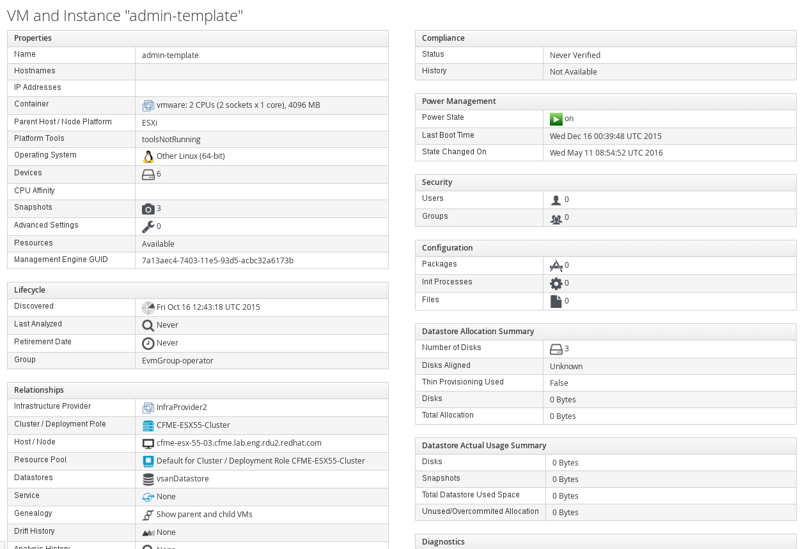

### Textual Summary

Textual summaries display details about a selected entity (such as VM, Host,
Network, Cluster, Container etc.) and also related entities (Snapshots for VM,
Hardware for Host etc.).



Textual summaries consists of groups of related information and each group consists of properties.

Definitions of these can be found in modules named according to scheme
`XxxHelper::TextualSummary` in `app/helpers/*_helper/textual_summary.rb`.

Example group definition:
```
def textual_group_properties
  %i(vapp aggregate_cpu_speed aggregate_cpu_memory aggregate_physical_cpus aggregate_cpu_total_cores aggregate_vm_memory aggregate_vm_cpus)
end

def textual_group_relationships
  %i(parent_datacenter parent_cluster parent_host direct_vms allvms_size total_vms)
end
```

Example property definitions:
```
  def textual_vapp
    {:label => _("vApp"), :value => @record.vapp}
  end

  def textual_aggregate_cpu_total_cores
    {:label => _("Total %{title} CPU Cores") % {:title => title_for_host},
     :value => number_with_delimiter(@record.aggregate_cpu_total_cores)}
  end

  def textual_aggregate_cpu_memory
    {:label => _("Total %{title} Memory") % {:title => title_for_host},
     :value => number_to_human_size(@record.aggregate_memory.megabytes, :precision => 0)}
  end
```

